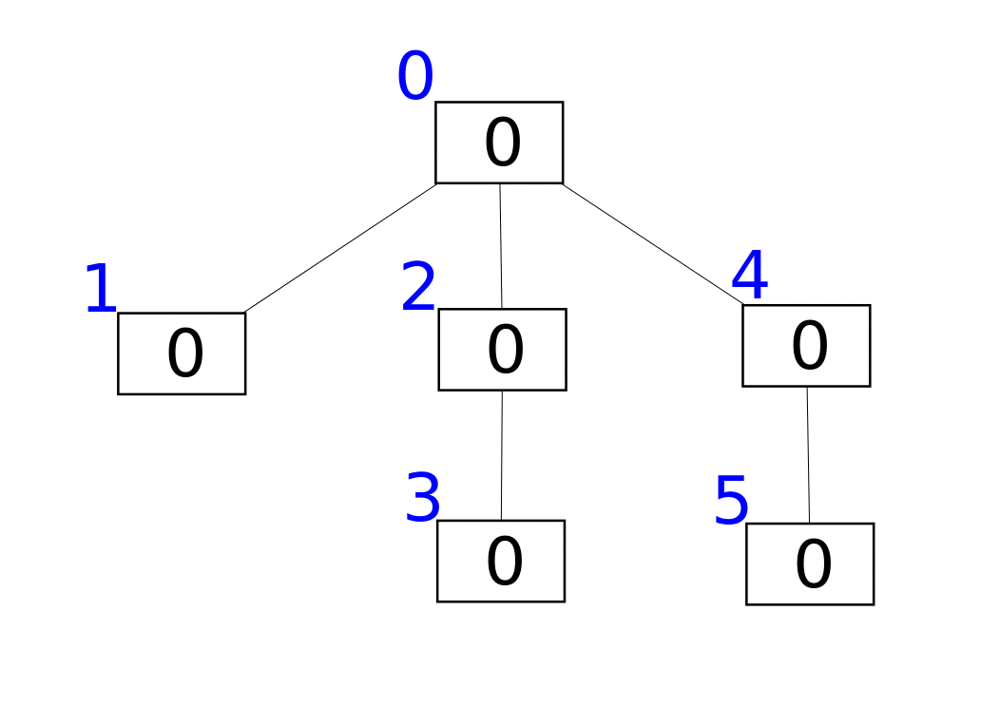

## 前缀和
前缀和是一种重要的预处理，能大大降低查询的时间复杂度。可以简单理解为“数列的前 n 项的和”。  
  
例子：  
有 N 个的正整数放到数组 A 里，现在要求一个新的数组 B，新数组的第 i 个数 `B[i]` 是原数组 A 第 0 到第 i 个数的和。  
```
输入：
5
1 2 3 4 5

输出：
1 3 6 10 15
```  
  
应用例子与场景：  
对于一个一维数组，如果要求区间 $[i .. k]$ 的和，可以用一个循环加起来，但是这样是比较耗时间的，如果利用前缀和，只需要用 $sum[k] - sum[i-1]$ 就可以快速得到答案。对于一个二维数组，也可以进行同样的操作。  
即前缀和主要适用的场景是原始数组不会被修改的情况下，频繁查询某个区间的累加和或其他类别统计（比如可以是前缀乘积等等）。  
  
### 二维/多维前缀和
多维前缀和的普通求解方法几乎都是基于[容斥原理](https://oi-wiki.org/math/inclusion-exclusion-principle/)。  
下面的代码演示了如何求一个二维数组 a 中从 $a[x][y]$ 到 $a[x1][y1]$ 所有数值的和：  
```java
int ans = sum[x1][y1] - sum[x-1][y1] - sum[x1][y-1] + sum[x-1][y-1];
```  
  
**基于 DP 计算高维前缀和**  
基于容斥原理来计算高维前缀和的方法，其优点在于形式较为简单，无需特别记忆，但当维数升高时，其复杂度较高。此时可以用一种基于 DP 计算高维前缀和的方法。该方法即通常语境中所称的**高维前缀和**。  
  
**树上前缀和**  
设 sum<sub>i</sub> 表示结点 i 到根节点的权值总和。  
  
### 性能
前缀和可以在 O(n) 时间统计和修改，在 O(1) 时间内查询统计任意区间之和。  
  
  
  
## 差分
> 差分，又名差分函数或差分运算，差分的结果反映了离散量之间的一种变化，是研究离散数学的一种工具。
  
差分是一种和前缀和相对的策略，可以当做是求和的逆运算。  
这种策略的定义是：  
B<sub>i</sub> = A<sub>i</sub> - A<sub>i-1</sub> (2 <= i <= n)  
B<sub>i</sub> = A<sub>1</sub> (i = 1)  
  
### 一维差分
定义 $b[i] = a[i] - a[i-1]$ ，可得 $a[i]=\displaystyle \sum^{i}_{j = 1}{b[j]}$ ,那么就称 b 是 a 的差分数组。  
差分数组可以将对 a 数组任意区间的同一操作（比如对 a 数组区间 $[l,r]$ 同时加上 c 的操作，只需要执行 $a[l]+c$ 和 $a[r+1]-c$）优化到 O(1)。  
通过这个 b 差分数组是可以反推出原始数组 a 的，代码逻辑如下：  
```java
int[] a = new int[b.length];
// 根据差分数组构造原始数组
a[0] = b[0];
for (int i = 1; i < b.length; i++) a[i] = a[i - 1] + b[i];
```  
只要花费 O(1) 的时间修改 b 数组，就相当于给 a 的整个区间做了修改。多次修改 b，然后通过 b 数组反推，即可得到 a 修改后的结果。  
  
### 二维差分
与一维差分一样二维差分可以把对矩阵的同一操作优化到 O(1)。  
  
### 树上差分
树上差分可以理解为对树上的某一段路径进行差分操作，这里的路径可以类比一维数组的区间进行理解。例如在对树上的一些路径进行频繁操作，并且询问某条边或者某个点在经过操作后的值的时候，就可以运用树上差分思想了。  
树上差分通常会结合`树基础`和`最近公共祖先`来进行考察。树上差分又分为`点差分`与`边差分`，在实现上会稍有不同。  
  
### 性能
差分可看作前缀和的“逆运算”，可在 O(1) 时间操作任意区间。  
  
  
  
## 树状数组
树状数组插入和查询都可以优化到 O(logN)。差分和前缀和适合用在查询或修改次数十分巨大的时候，当修改和查询在同一复杂度时适合用树状数组。  
*树状数组或二元索引树（英语：Binary Indexed Tree），又以其发明者命名为 Fenwick 树，最早由 Peter M. Fenwick 于1994年以 A New Data Structure for Cumulative Frequency Tables 为题发表在 SOFTWARE PRACTICE AND EXPERIENCE。其初衷是解决数据压缩里的累积频率（Cumulative Frequency）的计算问题，现多用于高效计算数列的前缀和，区间和。它可以以 $\displaystyle O(\log n)$ 的时间得到任意前缀和 $\displaystyle \sum _{i=1}^{j}A[i],1<=j<=N$，并同时支持在 $\displaystyle O(\log n)$ 时间内支持动态单点值的修改。空间复杂度 $\displaystyle O(n)$。*  
  
根据数组 `[1, 2, 3, 4, 5]` 来创建对应的树状数组：  
  
  
树状数组和线段树相似，但还有一些区别：树状数组能有的操作，线段树一定有；线段树有的操作，树状数组不一定有。  
更多树状数组内容待更新...   
  
  
  
## 参考
https://zhuanlan.zhihu.com/p/108064211  
https://oi-wiki.org/basic/prefix-sum/  
https://www.ershicimi.com/p/f2c311e2fd942d4c56ba89a8e3dd82c9  
https://zh.wikipedia.org/wiki/%E6%A0%91%E7%8A%B6%E6%95%B0%E7%BB%84  
