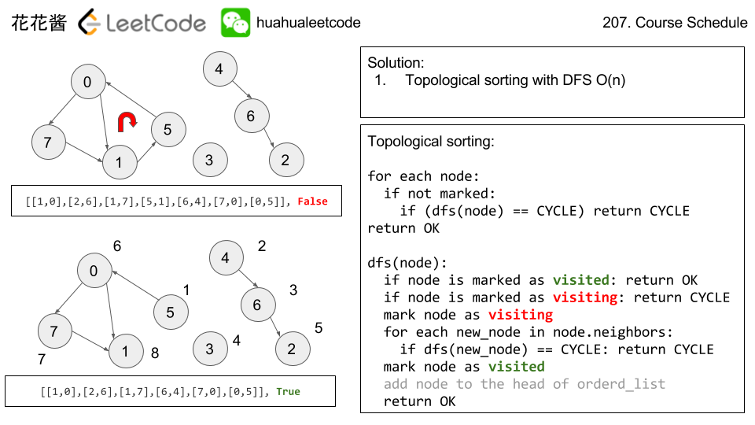
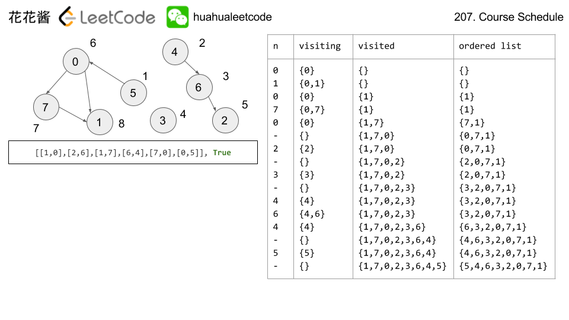

## 拓扑排序
  
有向图的拓扑排序是其顶点（节点）的线性排序，使得对于从顶点（节点） u 到顶点（节点）v 的每个有向边 uv，u 在排序中都在 v 之前。  
例如，图形的顶点（节点）可以表示要执行的任务，并且边可以表示一个任务必须在另一个任务之前执行的约束；在这个应用中，拓扑排序只是一个有效的任务顺序。  
当且仅当图中没有定向环时（即有向无环图），才有可能进行拓扑排序。  
任何有向无环图至少有一个拓扑排序。已知有算法可以在线性时间内，构建任何有向无环图的拓扑排序。  
在图论中，由一个有向无环图的顶点（节点）组成的序列，当且仅当满足下列条件时，才能称为该图的一个拓扑排序（英语：Topological sorting）：  
1. 序列中包含每个顶点（节点），且每个顶点（节点）只出现一次；
2. 若A在序列中排在B的前面，则在图中不存在从B到A的路径。  
  
拓扑排序有两种办法：卡恩算法、DFS。  
  
### 卡恩算法
ToDo...  
  
### DFS
  
  
  
  
代码实现：  
```java
class Solution {    
    public List<Integer> TopoSort(int numCourses, int[][] prerequisites) {        
        ArrayList<ArrayList<Integer>> graph = new ArrayList<>();
        ArrayList<Integer> sortedList = new ArrayList<>();
        
        for (int i = 0; i < numCourses; ++i)
            graph.add(new ArrayList<Integer>());
        
        for (int i = 0; i < prerequisites.length; ++i) {
            int course = prerequisites[i][0];
            int prerequisite = prerequisites[i][1];            
            graph.get(course).add(prerequisite);
        }
        
        // int[] visited -- states: 0 == unkonwn, 1 == visiting, 2 == visited
        int[] visited = new int[numCourses];
        for (int i = 0; i < numCourses; ++i)
            if (dfs(i, graph, visited, sortedList)) return new ArrayList<>(); // empty list means fail with circle
        
        return sortedList;
    }
    
    private boolean dfs(int curr, ArrayList<ArrayList<Integer>> graph, int[] visited, ArrayList<Integer> sortedList) {
        if (visited[curr] == 1) return true;
        if (visited[curr] == 2) return false;
        
        visited[curr] = 1;
                
        for (int next : graph.get(curr))
            if (dfs(next, graph, visited)) return true;
        
        if (!sortedList.contains(curr)) sortedList.add(curr);
        visited[curr] = 2;
        return false;
    }
}
```
  
[相关题型](./../Leetcode%20Practices/algorithms/medium/207%20Course%20Schedule.java)  
  
参考：  
http://zxi.mytechroad.com/blog/graph/leetcode-207-course-schedule/  
https://zh.wikipedia.org/wiki/%E6%8B%93%E6%92%B2%E6%8E%92%E5%BA%8F/  
https://oi-wiki.org/graph/topo/  
https://oi-wiki.org/graph/dag/  
