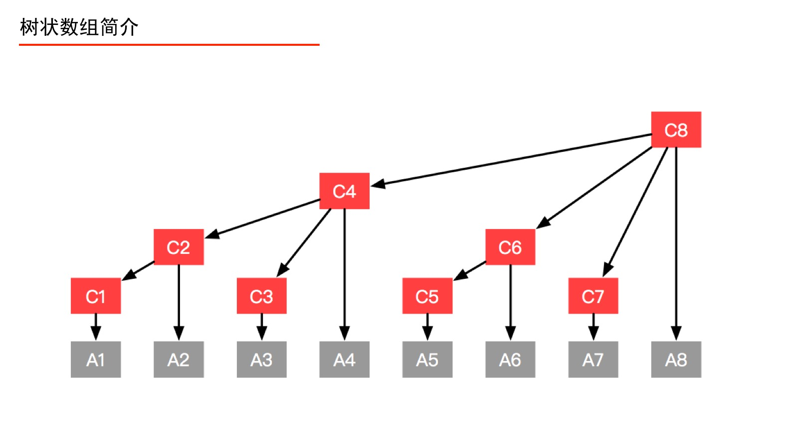
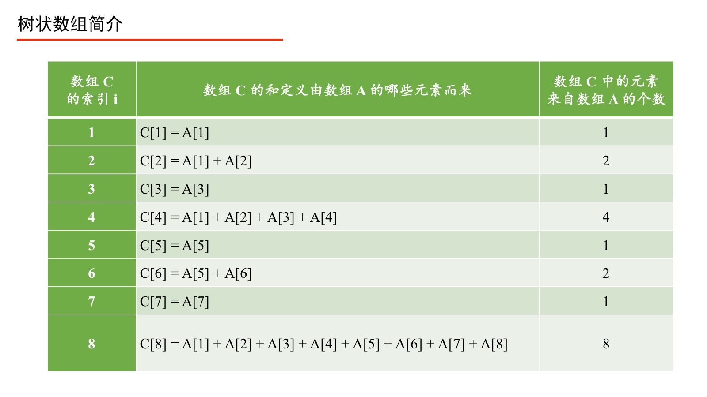
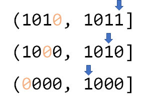
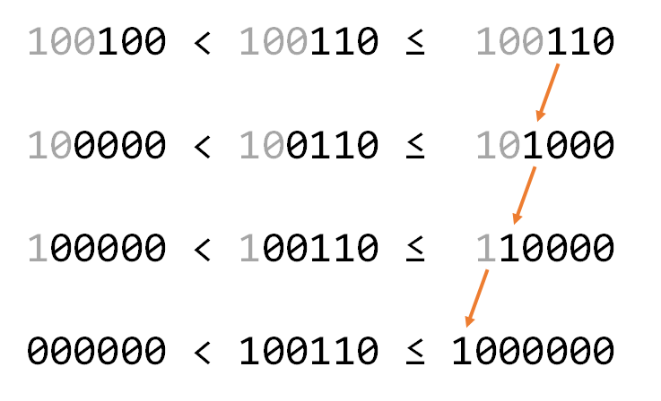

## 前置知识
[前缀和与差分](../../../Common%20Algorithm%20and%20Theory/前缀和与差分.md)  
  
## 树状数组
如果要执行“单点更新”，就得更新前缀和数组，又得计算一次前缀和，时间复杂度为 O(N)。那如果在一次业务场景中“前缀和”和“单点更新”的次数都很多，前缀和数组就不高效了。而 Fenwick 树（树状数组）就是“高效的”实现“前缀和”和“单点更新”这两个操作的数据结构。  
树状数组插入和查询都可以优化到 O(logN)。差分和前缀和适合用在查询或修改次数十分巨大的时候，当修改和查询在同一复杂度时适合用树状数组。  
树状数组或二元索引树（英语：Binary Indexed Tree），简称 BIT，又以其发明者命名为 Fenwick 树，最早由 Peter M. Fenwick 于1994年以 A New Data Structure for Cumulative Frequency Tables 为题发表在 SOFTWARE PRACTICE AND EXPERIENCE。其初衷是解决数据压缩里的累积频率（Cumulative Frequency）的计算问题，现多用于高效计算数列的前缀和，区间和。它可以以 $\displaystyle O(\log n)$ 的时间得到任意前缀和 $\displaystyle \sum _{i=1}^{j}A[i],1<=j<=N$，并同时支持在 $\displaystyle O(\log n)$ 时间内支持动态单点值的修改。空间复杂度 $\displaystyle O(n)$。  
  
根据数组 `[1, 2, 3, 4, 5]` 来创建对应的树状数组：  
  
  
树状数组长什么样子  
  

例：以一个有 8 个元素的数组 A 为例（如上图），在数组 A 之上建立一个数组 C，使得数组 C 的形成如上的一个多叉树形状，数组 C 就是一个树状数组。此时有以下疑问：  
1、树状数组要建成动态的树形结构吗？  
分析：不。学习过堆、线段树的一定知道，使用数组就能方便地索引左右孩子结点、双亲结点（因为规律特别容易找到），这样的树就不必创建成结点、指针那样的动态树形结构。  
2、如何解释“前缀和查询”、“单点更新”？  
分析：例如当要查询“前缀和(4)”，本来应该问 A1、A2、A3、A4，有了数组 C 之后，只要问 C4 即可。再如，要更新结点 A1 的值，只要自底向上更新 C1、C2、C4、C8 的值即可。  
  
理解数组 C 的定义  
首先强调一下，树状数组的下标从 1 开始计数，这一点看到后面就会很清晰了。先了解如下的定义，请一定先记住这些记号所代表的含义：  
1. 数组 C 是一个对原始数组 A 的预处理数组。
2. 还要熟悉几个记号。为了方便说明，避免后面行文啰嗦，将固定使用记号 i、j、k，它们的定义如下：
    * 记号 i：表示预处理数组 C 的索引（十进制表示）。
    * 记号 j：表示原始数组 A 的索引（十进制表示）。  

通过以下的图，来看看 C1、C2、C3、C4、C5、C6、C7、C8 分别是如何定义的。  
  
  
  
  
  
  
  
  
关于数组 C 与 k：将数组 C 的索引 i 表示成二进制，从右向左数，遇到 1 则停止，数出 0 的个数记为 k，则计算 2k 就是“数组 C 中的元素来自数组 A 的个数”，并且可以具体得到来自数组 A 的表示，即从当前索引 i 开始，从右向前数出 2k 个数组 A 中的元素的和，即组成了 C[i]。  
记号 k ：将 i 的二进制表示从右向左数出的 0 的个数，遇到 1 则停止，记为 k。只对数组 C 的索引 i 进行这个计算，数组 A 的索引 j 不进行相应的计算。  
例：当 i=8 时，计算 k。  
分析：因为 8 的二进制表示是 00001000，从右边向左边数遇到 1 之前，遇到了 3 个 0，此时 k = 3。计算出 k 以后，2k 即 8 立马得到。  

一种很方便的操作，叫做 lowbit，它可以高效地计算 2k，即要证明：  
**lowbit(i) = 2k**  

**lowbit(i) = i & (-i)**  
解释：如果直接将一个整数“按位取反”，再与原来的数做“与”运算，一定得到 0。巧就巧在，负数的二进制表示上，除了要求对“按位取反”以外，还要“加” 1，在“加” 1 的过程中产生的进位数即是“将 i 表示成二进制以后，从右向左数，遇到 1 停止时数出 0 的个数”。  
  
**parent(i) = i + lowbit(i)**  
  
待续：更多树状数组详解有待添加/更新，参考[链接](https://www.acwing.com/blog/content/80/) ...  
  
  
  
## 解释 2
**树状数组的引入**  
要实现两种操作：单点修改和区间求和。对于普通数组而言，单点修改的时间复杂度是 O(1)，但区间求和的时间复杂度是 O(N)。  
  
**普通数组**  
当然，也可以用前缀和的方法维护这个数组，这样的话区间求和的时间复杂度就降到了 O(1)，但是单点修改会影响后面所有的元素，时间复杂度是 O(N)。  
  
程序最后跑多长时间，是由最慢的一环决定的，因此希望找到这样一种折中的方法：无论单点修改还是区间查询，它都能不那么慢地完成。  
  
注意到对 [a, b] 进行区间查询只需查询 [1, b] 和 [1, a] 然后相减即可（前缀和就是这样进行区间查询的），所以可以把区间查询问题转化为求前 n 项和的问题。  
  
关于数组的维护，有个很自然的想法：可以用一个数组 C 维护若干个小区间，单点修改时，只更新包含这一元素的区间；求前 n 项和时，通过将区间进行组合，得到从 1 到 n 的区间，然后对所有用到的区间求和。实际上，设原数组是 A，如果 Ci 维护的区间是 [Ai, Ai]，此结构就相当于普通数组（还浪费了一倍内存）；如果 Ci 维护的区间就是 [1, Ai] ，此结构就相当于前缀和。  
  
现在试图寻找一种结构，一方面，单点修改时需要更新的区间不会太多；另一方面，区间查询时需要用来组合的区间也不会太多。  
  
### 树状数组实现
树状数组就是这样一种结构，它巧妙地利用了二进制（实际上，树状数组的英文名 BIT，直译过来就是二进制下标树）。例如 11，转化为二进制数就是 (1011)2，如果要求前 11 项和，可以分别查询 ((0000)2, (1000)2]、((1000)2, (1010)2] 以及 ((1010)2, (1011)2] 的和再相加。这三个区间怎么来的呢？其实就是不断地去掉二进制数最右边的一个 1 的过程（如下图）。  
  
  
定义，二进制数最右边的一个 1，连带着它之后的 0 为 lowbit(x)（稍后再来看如何实现）。那么用 Ci 维护区间 (Ai - lowbit(Ai), Ai]，这样显然查询前 n 项和时需要合并的区间数是少于 log2N 的。树状数组的结构大概像下面这样：  
  
更新就是一个“爬树”的过程。一路往上更新，直到 MAXN（树状数组的容量）。  
举个例子来看看这树是怎么爬的。 现有二进制数 (100110)2，包含它的最小区间当然是 ((100100)2, (100110)2]。然后，它也肯定位于区间 ((100000)2, (101000)2] 内。然后是 ((100000)2, (110000)2]，再然后是 (0, (1000000)2] ......  
  
如上图，每一步都把从右边起一系列连续的 1 变为 0，再把这一系列 1 的前一位 0 变为 1。这看起来像是一个进位的过程对吧？实际上，每一次加的正是 lowbit(x)。这样，更新的区间数不会超过 log2MAXN。一个能以 O(logN) 时间复杂度进行单点修改和区间查询的数据结构就诞生了。  
  
lowbit 怎么算？如果一位一位验证的话，会形成额外的时间开销。但可以使用以下公式：  
`lowbit(x) = (x) & (-x)`  
这是因为计算机里有符号数一般是以补码的形式存储的。-x 相当于 x 按位取反再加 1，会把结尾处原来 1000... 的形式，变成 0111...，再变成 1000...；而前面每一位都与原来相反。这时再把它和 x 按位与，得到的结果便是 lowbit(x)。  
  
[树状数组代码实现](./FenwickTree.java)  
  
  
树状数组和线段树相似，但还有一些区别：树状数组能有的操作，线段树一定有；线段树有的操作，树状数组不一定有。  
  
### 参考
https://zh.wikipedia.org/wiki/%E6%A0%91%E7%8A%B6%E6%95%B0%E7%BB%84  
https://www.acwing.com/blog/content/80/  
https://jojozhuang.github.io/algorithm/data-structure-fenwick-tree  
https://zhuanlan.zhihu.com/p/93795692  
