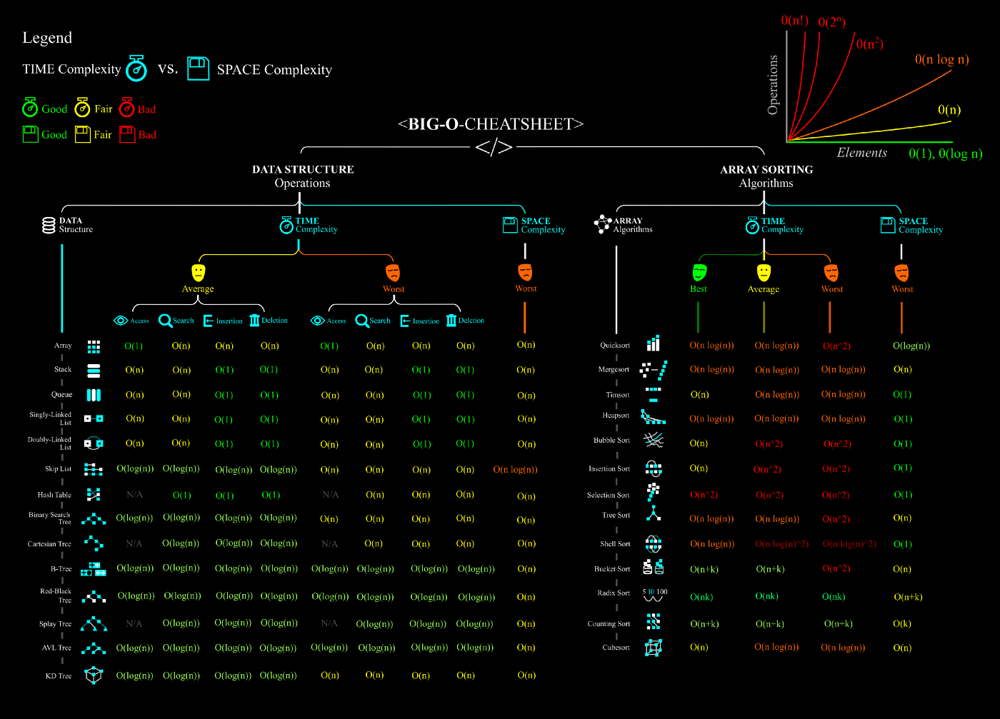

# 常用数据结构
  
- [数组 | Array]() (索引 O(1)，搜索 O(N)，插入/删除节点 O(N))
- [线性表 | Linear List]()
  - [顺序表 | ArrayList]() (索引 O(1)，搜索 O(N)，添加节点 O(1)，插入/删除节点 O(N))
  - [链表 | LinkedList](./Data%20Structure%20Implementation/Linked%20List/README.md) (索引 O(N)，搜索 O(N)，插入/删除节点 O(1))
    - [单链表 | Singly Linked List]()
    - [双链表 | Doubly Linked List]()
    - [循环链表 | Circular Linked List]()
- [队列 | Queue]()
  - [链表 | LinkedList](./Data%20Structure%20Implementation/Linked%20List/README.md) (入队/出队 O(1)，首值 O(1))
  - [优先队列 | PriorityQueue]() (搜索 O(N)，入队/出队 O(logN)，首值 O(1))
  - [双端队列 | Deque]()
    - [链表 | LinkedList](./Data%20Structure%20Implementation/Linked%20List/README.md) (同上)
    - [数组双端队列 | ArrayDeque](./../HackerRank%20Practises/java/medium/Java%20Dequeue.java)
    - [基于链表的线程安全无界双端队列 | ConcurrentLinkedDeque]()
    - [基于链表的FIFO双端阻塞队列 | LinkedBlockingDeque]()
  - [基于链表的线程安全无界队列 | ConcurrentLinkedQueue]()
  - [阻塞队列 | BlockingQueue](./Data%20Structure%20Implementation/Blocking%20Queue/README.md)
    - [基于数组的并发阻塞队列 | ArrayBlockingQueue]() (入队/出队 O(1)，首值 O(1))
    - [延期阻塞队列 | DelayQueue]() (入队/出队 O(logN)，首值 O(1))
    - [基于链表的FIFO双端阻塞队列 | LinkedBlockingDeque]()
    - [基于链表的FIFO阻塞队列 | LinkedBlockingQueue]() (入队/出队 O(1)，首值 O(1))
    - [并发同步阻塞队列 | SynchronousQueue]() (入队/出队 O(1)，首值 O(1))
    - [带优先级的无界阻塞队列 | PriorityBlockingQueue]() (入队/出队 O(logN)，首值 O(1))
    - [基于链表的FIFO无界阻塞队列 | LinkedTransferQueue]()
- [栈 | Stack]() (入栈/出栈 O(1))
- [堆 | Heap]()
  - [二叉堆 | Binary Heap]() (搜索 O(N)，插入/删除节点 O(logN))
  - [斐波那契堆 | Fibonacci Heap]()
- [映射表 | Map/Table]()
  - [散列表 | HashMap](./Data%20Structure%20Implementation/Hash%20Map/README.md) (索引搜索 O(1)，插入/删除节点 O(1))
  - [并发散列表 | ConcurrentHashMap]() (索引搜索 O(1)，插入/删除节点 O(1))
  - [链散列表 | LinkedHashMap]() (按插入顺序的散列表，索引搜索 O(1)，插入/删除节点 O(1))
  - [树状映射表 | TreeMap]() (索引搜索 O(logN)，插入/删除节点 O(logN))
- [集合 | Set]()
  - [散列集 | HashSet]() (索引搜索 O(1)，插入/删除节点 O(1))
  - [链散列集 | LinkedHashSet]() (索引搜索 O(1)，插入/删除节点 O(1))
  - [树集 | TreeSet]() (索引搜索 O(logN)，插入/删除节点 O(logN))
- [树 | Tree]()
  - [二叉搜索树 | Binary Search Tree]() (搜索 O(logN) - O(N)，插入/删除节点 O(1))
  - [平衡二叉搜索树 | Self-Balanced Binary Search Tree]()
    - [AVL树 | AVL Tree](./Data%20Structure%20Implementation/AVL%20Tree/) (搜索 O(logN)，插入/删除节点 O(logN))
    - [红黑树 | Red-Black Tree]() (搜索 O(logN)，插入/删除节点 O(logN))
  - [平衡搜索树 | Self-Balanced Search Tree]()
    - [B树 | B Tree]()
    - [B+树 | B Tree]()
    - [2–3树 | 2-3 Tree]()
  - [字典树 | Trie](./Data%20Structure%20Implementation/Trie/README.md)
  - [并查集 | Disjoint-Set/Union-Find Forest]()
- [图 | Graph]()
  - [有向图 | Directed Graph]()
  - [无向图 | Undirected Graph]()
  - [加权图 | Weighted Graph]()
  
以上有些数据结构可能只有 Java 提供了官方实现 [more](https://www.zhihu.com/question/325814788) ，以上总结未完待续...  
  
*术语表：索引 - get | 搜索 - search | 添加 - add | 插入 - insert | 删除 - remove | 入队 - offer | 出队 - poll | 首值 - peek*  
  
### 常用数据结构的一些细节补充
* HashMap 与 Hashtable 有[区别](https://stackoverflow.com/questions/40471/differences-between-hashmap-and-hashtable)，Map、Dictionary、Table 的[异同](https://www.zhihu.com/question/27581780)。
* Java 的数组/array 是语言本身提供的，而 ArrayList、LinkedList、Vector(向量) 等等都是 Java Util 包基于数组实现的，参见[图解](./Java%20Util%20Collections.png)。Java 中 ArrayList、LinkedList、Vector 的[区别](https://www.cnblogs.com/wanlipeng/archive/2010/10/21/1857791.html)。
* Java 里，枚举（Enumeration）接口虽然它本身不属于数据结构,但它在其他数据结构的范畴里应用很广。枚举（The Enumeration）接口定义了一种从数据结构中取回连续元素的方式。
* 堆/Heap 是计算机科学中的一种特别的树状数据结构（比如堆排序/heap sort，是基于二叉堆树作为此算法的数据结构）。
* Java 中，Queue 是通过 LinkedList 实现的而不是 ArrayList，[原因](https://stackoverflow.com/questions/41665425/why-arraylist-doesnt-implements-queue)。  
  
## 表格示
List                 | Add  | Remove | Get  | Contains | Next | Data Structure
---------------------|------|--------|------|----------|------|---------------
ArrayList            | O(1) |  O(n)  | O(1) |   O(n)   | O(1) | Array
LinkedList           | O(1) |  O(1)  | O(n) |   O(n)   | O(1) | Linked List
CopyOnWriteArrayList | O(n) |  O(n)  | O(1) |   O(n)   | O(1) | Array
  
Set                   |    Add   |  Remove  | Contains |   Next   | Size | Data Structure
----------------------|----------|----------|----------|----------|------|-------------------------
HashSet               | O(1)     | O(1)     | O(1)     | O(h/n)   | O(1) | Hash Table
LinkedHashSet         | O(1)     | O(1)     | O(1)     | O(1)     | O(1) | Hash Table + Linked List
EnumSet               | O(1)     | O(1)     | O(1)     | O(1)     | O(1) | Bit Vector
TreeSet               | O(log n) | O(log n) | O(log n) | O(log n) | O(1) | Red-black tree
CopyOnWriteArraySet   | O(n)     | O(n)     | O(n)     | O(1)     | O(1) | Array
ConcurrentSkipListSet | O(log n) | O(log n) | O(log n) | O(1)     | O(n) | Skip List
  
Queue                   |  Offer   | Peak |   Poll   | Remove | Size | Data Structure
------------------------|----------|------|----------|--------|------|---------------
PriorityQueue           | O(log n) | O(1) | O(log n) |  O(n)  | O(1) | Priority Heap
LinkedList              | O(1)     | O(1) | O(1)     |  O(1)  | O(1) | Array
ArrayDequeue            | O(1)     | O(1) | O(1)     |  O(n)  | O(1) | Linked List
ConcurrentLinkedQueue   | O(1)     | O(1) | O(1)     |  O(n)  | O(n) | Linked List
ArrayBlockingQueue      | O(1)     | O(1) | O(1)     |  O(n)  | O(1) | Array
PriorirityBlockingQueue | O(log n) | O(1) | O(log n) |  O(n)  | O(1) | Priority Heap
SynchronousQueue        | O(1)     | O(1) | O(1)     |  O(n)  | O(1) | None!
DelayQueue              | O(log n) | O(1) | O(log n) |  O(n)  | O(1) | Priority Heap
LinkedBlockingQueue     | O(1)     | O(1) | O(1)     |  O(n)  | O(1) | Linked List
  
Map                   |   Get    | ContainsKey |   Next   | Data Structure
----------------------|----------|-------------|----------|-------------------------
HashMap               | O(1)     |   O(1)      | O(h / n) | Hash Table
LinkedHashMap         | O(1)     |   O(1)      | O(1)     | Hash Table + Linked List
IdentityHashMap       | O(1)     |   O(1)      | O(h / n) | Array
WeakHashMap           | O(1)     |   O(1)      | O(h / n) | Hash Table
EnumMap               | O(1)     |   O(1)      | O(1)     | Array
TreeMap               | O(log n) |   O(log n)  | O(log n) | Red-black tree
ConcurrentHashMap     | O(1)     |   O(1)      | O(h / n) | Hash Tables
ConcurrentSkipListMap | O(log n) |   O(log n)  | O(1)     | Skip List
  
以下参考自：https://gist.github.com/psayre23/c30a821239f4818b0709  
  
## 图示
  
  
  
  
  
## 非常用的专用数据结构
- [参考阅读](https://stackoverflow.com/questions/500607/what-are-the-lesser-known-but-useful-data-structures)  
  
  
  
# 常用数据类型
- [布尔型 | Boolean]()
- [字节 | Byte]()
- [整型 | Integer]()
  - [有符号整型 | Signed Integer]()
  - [无符号整型 | Unsigned Integer]()
- [浮点型 | Float]()
- [字符串 | String]()
- [字符 | Character]()  
  
以上总结未完待续...  
  
### 常用数据类型的一些细节补充
* 有些编程语言（比如 Java 早期版本）不支持 unsigned（无符号）数据类型（如 unsigned char, unsigned short, unsigned int 和 unsigned long 等等），因此在一些与 Bitwise 或数据类型符号相关的题目中需要注意，参见[例子](./../Leetcode%20Practices/algorithms/easy/190%20Reverse%20Bits.java)。
  
