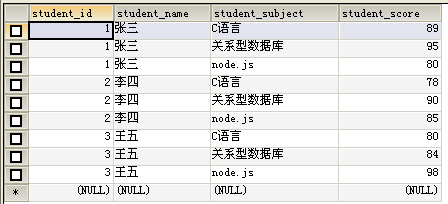
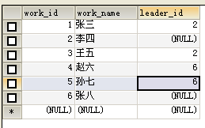

# 物理相关
  
## 索引
在关系数据库中，如果有上万甚至上亿条记录，在查找记录的时候，想要获得非常快的速度，就需要使用索引（Index）。  
索引是关系数据库中对某一列或多个列的值进行预排序的数据结构。通过使用索引，可以让数据库系统不必扫描整个表，而是直接定位到符合条件的记录，这样就大大加快了查询速度。  
索引问题就是一个查找问题。数据库索引，是数据库管理系统中一个排序的数据结构，以协助快速查询、更新数据库表中数据。索引的实现通常使用 B 树及其变种 B+ 树。在数据之外，数据库系统还维护着满足特定查找算法的数据结构，这些数据结构以某种方式引用（指向）数据，这样就可以在这些数据结构上实现高级查找算法。这种数据结构，就是索引。为表设置索引要付出代价的：一是增加了数据库的存储空间，二是在插入、删除和修改数据时要花费较多的时间（因为索引也要随之变动）。  
  
### 索引实现
* B-Tree 索引 O(logN)：具体比如 B+ 树，可以参考 `MySQL 索引背后的数据结构及算法原理`
* Hash 索引：1. 仅仅能满足 "="，"IN" 和 "<=>" 查询，不能使用范围查询；2. 其检索效率非常高，索引的检索可以一次定位，不像 B-Tree 索引需要从根节点到枝节点，最后才能访问到页节点这样多次的 IO 访问，所以 Hash 索引的查询效率要远高于 B-Tree 索引；3. 只有 Memory 存储引擎显示支持 Hash 索引
* Full-Text 索引：现在 MyISAM 和 InnoDB 引擎都支持
* 位图索引：Bitmap Index
* 空间索引：具体比如 R-Tree 索引用于对 GIS 数据类型创建 SPATIAL 索引  
  
B-Tree 索引应该是 MySQL 里最广泛应用的索引实现。  
MySQL 默认存储引擎 InnoDB 默认使用 B-Tree（实际是 B+ Tree）索引。Innodb 存储引擎会监控对表上二级索引（即非主键索引）的查找，如果发现某二级索引被频繁访问，二级索引成为热数据，建立哈希索引可以带来速度的提升，经常访问的二级索引数据会自动被生成到 Hash 索引里面去（最近连续被访问三次的数据），自适应 Hash 索引通过缓冲池的 B+ 树构造而来，因此建立的速度很快。  
  
### 索引类型
* 主键索引：数据库表经常有一列或列组合，其值唯一标识表中的每一行。该列称为表的主键。在数据库关系图中为表定义主键将自动创建主键索引，主键索引是唯一索引的特定类型。当在查询中使用主键索引时，它还允许对数据的快速访问。使用主键索引的效率是最高的，因为主键会要求、保证绝对唯一。
* 唯一索引：索引列的值必须唯一，但允许有空值。
* 非唯一索引：索引列的值不是必须唯一。
* 普通索引：即一个索引只包含单个列，一个表可以有多个单列索引。
* 复合索引：即一个索引包含多个列。
* 聚集索引（物理）：并不是一种单独的索引类型，而是一种数据存储方式。表中行的物理顺序与键值的逻辑（索引）顺序相同。一个表只能包含一个聚集索引。与非聚集索引相比，聚集索引通常提供更快的数据访问速度。
* 非聚集索引（物理）：不是聚集索引的索引，表中行的物理顺序与键值的逻辑顺序不匹配。  
  
添加索引的示例代码：  
```sql
ALTER TABLE table_a
ADD INDEX idx_col1 (col1);
```  
  
### 存储引擎
主要引擎：  
* MyISAM：不支持事务型查询，在 OLTP 类型业务场景中不建议使用。
* InnoDB：支持事务型查询，支持行级锁，对并发业务支持较好。  
  
更多：  
  
  
## 建议阅读
https://blog.csdn.net/dong19891210/article/details/106969644  
  
# SQL 语法（进阶相关）
  
## SQL GROUP BY 语句
GROUP BY 作用的[直观图示](./README.md#在-select-中嵌套)  
GROUP BY 语句可结合一些聚合函数来使用  
  
GROUP BY 语句  
GROUP BY 语句用于结合聚合函数（包括：AVG、COUNT、MIN、MAX 和 SUM），根据一个或多个列对结果集进行分组。  
按列名分组，搭配聚合函数十分实用。  
例，统计每个班的人数:  
```SELECT student_class,COUNT(ALL student_name) AS 总人数 FROM t_student GROUP BY (student_class);```  
AS为定义别名，别名的使用在组合及联接查询时会有很好的效果。 
分组中也可以加入筛选条件WHERE，不过这里一定要注意的是，执行顺序为：WHERE过滤→分组→聚合函数。  
  
SQL GROUP BY 语法  
```sql
SELECT column_name, aggregate_function(column_name)
FROM table_name
WHERE column_name operator value
GROUP BY column_name;
```  
  
## SQL HAVING 子句
在 SQL 中增加 HAVING 子句原因是，WHERE 关键字无法与聚合函数一起使用。  
HAVING 子句可以让我们筛选分组后的各组数据。  
  
SQL HAVING 语法  
```sql
SELECT column_name, aggregate_function(column_name)
FROM table_name
WHERE column_name operator value
GROUP BY column_name
HAVING aggregate_function(column_name) operator value;
```  
  
## 子查询
为什么要子查询？  
现有一数据表如下：  
  
根据之前的知识我们可以查出每门科目的最高分，但是要想查出取得最高分的学生信息就做不到了。这时就需要用到子查询来取得完整的信息。  
  
什么是子查询？子查询就是嵌套在主查询中的查询。  
子查询可以嵌套在主查询中所有位置，包括 SELECT、FROM、WHERE、GROUP BY、HAVING、ORDER BY。  
但并不是每个位置嵌套子查询都是有意义并实用的。  
  
### 在 SELECT 中嵌套
现有表两张：一张学生表、一张班表。id 相关联  
  
  
  
学生信息和班级名称位于不同的表中，要在同一张表中查出学生的学号、姓名、班级名称：  
```sql
SELECT s.student_id,s.student_name,(SELECT class_name FROM t_class c WHERE c.class_id=s.class_id) FROM t_student s GROUP BY s.student_id;
```  
子查询中查出的是，班级表中的班级 id 与学生表中的班级 id 相同的行，注意 `WHERE c.class_id=s.class_id` 这里就是别名用法的一个很好的体现，区分开了两张表中同样列名的列。
结果：  
  
最后的 GROUP BY 可以理解为对重复行的去重，如果不加：  
  
  
### 在 WHERE 中嵌套
查出C语言成绩最高的学生的信息：  
```sql
SELECT * FROM t_student WHERE student_subject='C语言' AND student_score>=ALL (SELECT student_score FROM t_student WHERE student_subject='C语言');
```  
查出每门课最高成绩的学生的信息：  
```sql
SELECT * FROM t_student s1 WHERE s1.student_score >= ALL(SELECT s2.student_score FROM t_student s2 WHERE s1.`student_subject`=s2.student_subject);
```  
这里别名的用法情况就是在子查询或联接查询时，主查询及子查询均为对同一张表进行操作，为主、子查询中的表加上不同的别名能够很好的区分哪些列的操作是在主查询中进行的，哪些列的操作是在子查询中进行的，即主、子查询对同一张表操作，区分开位于内外表中相同的列名。  
  
### 子查询运算符分类
* ALL 运算符 - 和子查询的结果逐一比较，必须全部满足时表达式的值才为真。
* ANY 运算符 - 和子查询的结果逐一比较，其中一条记录满足条件则表达式的值就为真。
* EXISTS/NOT EXISTS 运算符 - EXISTS 判断子查询是否存在数据，如果存在则表达式为真，反之为假。NOT EXISTS 相反。  
  
在子查询或相关查询中，要求出某个列的最大值，通常都是用 ALL 来比较，大意为比其他行都要大的值即为最大值。  
  
### 子查询的分类
* 相关子查询
    * 执行依赖于外部查询的数据。
    * 外部查询返回一行，子查询就执行一次。
* 非相关子查询
    * 独立于外部查询的子查询。
    * 子查询总共执行一次，执行完毕后后将值传递给外部查询。  
  
相关子查询不推荐使用，因为相关子查询主查询执行一回，子查询就执行一回，十分耗费时间，尤其是当数据多的时候（前面第一个例子 SELECT 嵌套求学生对应班级名的即为相关子查询）。  
  
## 组合查询
UNION 操作符用于合并两个或多个 SELECT 语句的结果集。  
请注意，UNION 内部的每个 SELECT 语句必须拥有相同数量的列。列也必须拥有相似的数据类型。同时，每个 SELECT 语句中的列的顺序必须相同。  

  
  
通过 UNION 运算符来将两张表纵向联接，基本方式为：  
```
SELECT 列1 , 列2 FROM 表1
UNION
SELECT 列3 , 列4 FROM 表2;
```  
UNION ALL 为保留重复行：  
```
SELECT 列1 , 列2 FROM 表1
UNION ALL
SELECT 列3 , 列4 FROM 表2;
```  
组合查询并不是太实用，用的少之又少。  
  
## 表联接与联接查询
相关子查询效率低下，那怎么能将不同表的信息一起查询出来呢？这就需要用到表联接。  
和之前的 UNION 组合查询不同，UNION 是将不同的表组合起来，也就是纵向联接，说白了就是竖着拼起来。  
而表联接是通过笛卡尔乘积将表进行横向联接，所谓的通过笛卡尔乘积简单说就是两表的行依次相联再相加。  
  
Union VS Join:  
  
  
通过外键的匹配就得到了一张完美的联接之后的表，它可以看做一张新表，想要任何数据均可以从此表中查询，这就是表联接的强大之处。  
  
### 表联接的分类
现在有如下两张表：  
  
  
内联接：  
内联接是指两个表中某一行相关的列值匹配时，这一行才会出现在表中。比如 t_student._fk 与 t_class._infor 相同时才会出行该行，其他的行剔除。  
```sql
SELECT * FROM t_student INNER JOIN t_class ON t_class._infor = t_student._fk;
```
语法为 INNER JOIN 其中 INNER 可以省略。  
内联接的简写：  
```sql
SELECT * FROM t_student s,t_class c WHERE c._infor = s._fk 
```
此写法也是用的最多的。  
  
外联接：  
分为左外联接与右处联接。  
外联接是指不管有没有匹配，被定义了外联接的表数据都要出现在结果中。比如左外联接，那么在 JOIN 左边的表就被定义为外联接，那么此表中所有数据都会出现在查询结果中。  
注意班级表中的四班是没有学生的，所以在内联接之后理所当然的被剔除了。现在以外联接做示例：  
```sql
SELECT * FROM t_student s RIGHT JOIN t_class c ON s._fk=c._infor;
```
上面 SQL 中表 t_class 在写在 JOIN 的右边，所以用 RIGHT JOIN 来进行外联接。  
  
这就是外联接的用法，通常用在想要的数据匹配不上时。  
  
自联接：  
自联接属于内联接或外联接的一种特例，自联接所联接的表均是来自同一张。  
  
上表中，6个人均属于某公司的员工。区别是李四为张三和王五的领导，张八为赵六和孙七的领导。leader_id与work_id相关联。  
现在可以通过自联接巧妙的将一张表分为员工部分和领导部分：  
```sql
SELECT w.work_name,l.work_name 领导姓名 FROM t_emp w,t_emp l WHERE w.leader_id=l.work_id;
```  
结果：  
  
  
  
## SQL 的执行顺序
第一步：执行 FROM  
第二步：WHERE 条件过滤  
第三步：GROUP BY 分组  
第四步：执行 SELECT 投影列  
第五步：HAVING 条件过滤  
第六步：执行 ORDER BY 排序  
  
  
参考链接：  
https://www.cnblogs.com/ghost-xyx/p/3811036.html  
https://www.cnblogs.com/ghost-xyx/p/3813688.html  
  
  
## 什么是事务
数据库几乎是所有系统的核心模块，它将数据有条理地保存在储存介质（磁盘）中，支持数据的增、删、改、查，并在过程中保障数据的正确且可靠。  
但是这并非易事，常见的例子就是银行转账，A 账户给 B 账户转账一个亿（T1），买一块地盖房子。在这种交易的过程中，有几个问题值得思考：  
* 如何同时保证上述交易中，A 账户总金额减少一个亿，B 账户总金额增加一个亿？（原子性 Atomicity）
* A 账户如果同时在和 C 账户交易（T2），如何让这两笔交易互不影响？（隔离性 Isolation）
* 如果交易完成时数据库突然崩溃，如何保证交易数据成功保存在数据库中？（持久性 Durability）
* 如何在支持大量交易的同时，保证数据的合法性（没有钱凭空产生或消失）？（一致性 Consistency）  
  
要保证交易正常可靠地进行，数据库就得解决上面的四个问题，这也就是事务诞生的背景，它能解决上面的四个问题，对应地，它拥有四大特性：  
* 原子性（Atomicity）: 事务要么全部完成，要么全部取消。 如果事务崩溃，状态回到事务之前（事务回滚）。
* 隔离性（Isolation）: 如果 2 个事务 T1 和 T2 同时运行，事务 T1 和 T2 最终的结果是相同的，不管 T1 和 T2 谁先结束。
* 持久性（Durability）: 一旦事务提交，不管发生什么（崩溃或者出错），数据要保存在数据库中。
* 一致性（Consistency）: 只有合法的数据（依照关系约束和函数约束）才能写入数据库。  
  
  
### 保证原子性
```sql
begin; -- 开始一个事务
update table set A = A - 1亿; -- 伪 sql，仅作示意
update table set B = B + 1亿;
-- 其他读写操作
commit; -- 提交事务
```  
要保证上面操作的原子性，就得等 begin 和 commit 之间的操作全部成功完成后，才将结果统一提交给数据库保存，如果途中任意一个操作失败，就撤销前面的操作，且操作不会提交数据库保存，这样就保证了原子性。  
  
### 保证隔离性
数据的隔离机制，同时只能有一个事务在修改 A，一个修改完了，另一个才来修改，这通过对数据 A 加上互斥锁来实现。  
* 先获得了锁，然后才能修改对应的数据 A
* 事务完成后释放锁，给下一个要修改数据 A 的事务
* 同一时间，只能有一个事务持有数据 A 的互斥锁
* 没有获取到锁的事务，需要等待锁释放  
  
以原子性的示例代码为例，当 A 更新完毕后，正在更新 B 时（T1 还没有提交），有另外一个事务 T2 想要更新 A，它不能获取到 A 的互斥锁。在事务中更新某条数据获得的互斥锁，只有在事务提交或失败之后才会释放，在此之前，其他事务是只能读，不能写这条数据的。针对隔离性的强度，有以下四的级别：  
* 串行化（Serializabl）
* 可重复读（Repeatable read）
* 读取已提交（Read committed）
* 读取未提交（Read uncommitted）- 最低级别，可能会发生脏读  
  
  
### 保证持久性
如果在事务提交后，事务的数据还没有真正落到磁盘上，此时数据库奔溃了，事务对应的数据会不会丢？事务会保证数据不会丢，当数据库因不可抗拒的原因奔溃后重启，它会保证：1. 成功提交的事务，数据会保存到磁盘；2. 未提交的事务，相应的数据会回滚。数据库通过事务日志来达到这个目标。  
  
### 保证一致性
内部一致性：在事务开始之前和事务结束以后，数据库的完整性没有被破坏。这表示写入的资料必须完全符合所有的预设约束、触发器、级联回滚等。  
外部一致性：CAP 理论（强一致性、弱一致性、最终一致性）。  
  
  
以上参考链接：https://zhuanlan.zhihu.com/p/43493165  
  
# 优化
根据现网环境优化执行的难易度，在优化顺序可以按照：SQL 语句 -> 数据库表设计（比如范式、关系映射、索引、分表、数据类型等等）-> 数据库参数配置 -> 数据库存储引擎 -> 服务器硬件。通过编写高效的 SQL 语句，并以合适的方式创建表和索引，使系统始终保持良好的性能。  
务必学好树，特别是 B+ Tree，就会明白索引何时生效或失效。  
  
## 表设计优化
* 表体量过大：字段过多或者记录数过多的`大表`，在查询中会消耗大量资源，且执行效率低；建议根据业务类型拆分大表（分区表）。
* 使用外键：无论是 MySQL 还是 Oracle，都不建议采用外键进行表关联。
* 缺少主键：无论对于主从同步还是查询性能，主键发挥的作用都非常重要；建议所有业务表都添加主键。  
  
  
## 服务器硬件性能影响的常见因素
* CPU：一般情况下 CPU 资源不会是性能瓶颈的直接原因；MySQL 不支持多 CPU 对同一 SQL 并发处理。
* 内存：直接影响 MySQL 缓冲池的大小及 MySQL 数据库的整体运行稳定性；如内存资源不足，容易造成 MySQL 的会话拥堵甚至实例重启。
* 存储 IO：直接影响 MySQL 的处理性能；在大量数据变更的业务场景下，对存储的 IO 性能要求往往较高。  
  
  
