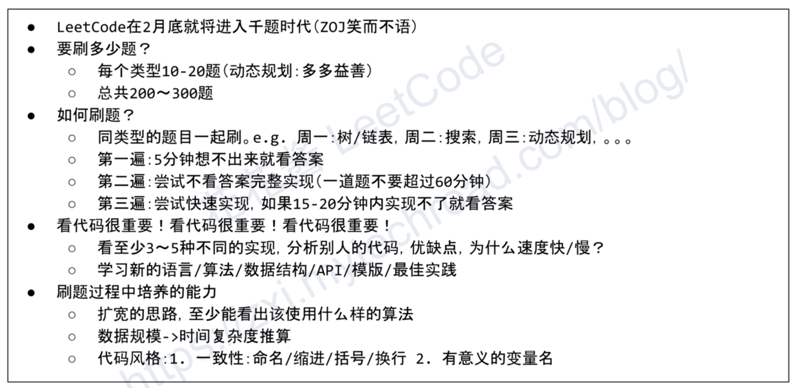

# data-structure-and-algorithm-study-note

### 本Repo包括以下内容:  
1. 数据结构网课笔记(http://bbs.fishc.com)  
2. 《Introduction to Algorithms》 Practices  
3. Common Sorts, Algorithm, Data Structure Implementation  
4. Codility Practices  
5. Google Code Jam Practices  
6. Leetcode Practices (每个问题第一次提交 round 1 是自己的首次解答方法，第二次提交 round 2 是进行复盘复习后并添加、理解他人的更优解以及增添其他语言解题实现，round 0 则是首次答题没头绪参考他人解题思路)  
7. 其他关于数据结构与算法的重要心得笔记  
  
  
### 刷题技巧与笔记:
#### 看题
1. 看题一，确定完全看懂题目，题目描述若一下子不理解可先看下面的例子解释来结合理解，再不行建议主动向考官交流、咨询。
2. 看题二，应留意及平时记住一些算法专业术语、题目描述术语，比如空间要求 in-place 即意为空间复杂度应为 O(1)。
#### 首先看完题目先不要急着做，进行下述几个思考阶段先
1. 思考一，理清题目本质，决定该题是什么类型数据结构、算法相关（如队列、堆栈、树、字符串、布尔或二进制、数组、图，如回溯法、动态规划、贪婪算法、二分搜索、二进制运算、迭代递归、遍历），通常若题目没有明显处理算法暗示或思绪提供时则可以考虑暴力破解如回溯法、递归循环穷举法或DFS、BFS等，又或通过题目性能要求推测考点算法 - 比如要求性能达到 logN 时即很可能要使用二分搜索算法。（记住递归可以顺序也可以反序 - 如面试金典 9.2-2.5 进阶）
2. 思考二，是否需要做一些预处理，如排序，又或者先做一些额外预处理比如补零数位以及遍历至尾，在从尾部往回处理（如面试金典 9.2-2.5 进阶）。这种情况往往出现在题目明显有违常规思路时，即总是有些条件、可能、边缘情况阻碍常规思路，意味着出题者可能是故意增加了一些难度需要解题者预处理。这些预处理工作即使看起来复杂且一开始不确定是否对解题有帮助也不妨试试，尽量按常规系统性方法解题（即上面所有 Leetcode 内的解题法分类如递归、动态规划等等，经验足够的话大的解题类方向通常一开始就可以定下来），可以分割困难，但不要苦思奇法。
3. 思考三，当题目已暗示可能要进行大规模输入检测题解效率时，可以考虑进行一些预处理、动态规划思路，例子如 Leetcode Q244。
4. 思考四，(草稿时)引入一些数学工具、模型 - 如状态机等等有助于理清思路与解题(例子如 Leetcode Q309，KMP 算法实现)，辅助的数学思想还可以包括且不限于加减乘除(商、余数)、开方、指数、对数、微积分(例如 Leetcode Q367 牛顿法)、素数、公约数、公倍数、概率、阶乘、数列、坐标、几何函数(sin、cos、tan)、矩阵、不等式、多项式、进位转换等等。
5. 思考五，有时有些题目未必是使用完整的某个算法来解题，有可能只是使用该算法的一部分或其某个某些工具（例如 Leetcode Q459 只使用 KMP 的 Partial Match Table）。
6. 思考六，有时题解没通过测试时不用先急着怀疑是自己的基本思路错误，有可能只是需要再对一些 edge cases 做优化即可（例如 Leetcode Q214）。
#### 编码时、做题中、Debug
1. 编码一，制作工具，即是否需要、可以把复杂或重复部分的逻辑、代码封装成一个函数。（大致方向已明晰的情况下，这样尤其有利于简化中间实现过程中一些中等的复杂、模糊的思绪）
2. 编码二，活用伪代码、注释行，以先画骨再填血肉的方式先把解题框架给出（系统、简单也有助于思考、理清思路）（甚至可以注释代替算法如递归，做题经验丰富后此方法较可行有益）。这在做题时遇到复杂题如思考二中遇到需要多项预处理且一开始不明朗是否有用的情况时有很大帮助。
3. 编码三，注意一些语言的相似数据结构的不同效率以及 performance，如 Java 的普通 Array 的时间及空间性能都会比 ArrayList 好很多。
4. 编码四，在没把握的前提下，先求解题而不先优化，比如递归很显然但迭代没头绪的情况下，优先使用显然的思路解题，除非题目要求用特定方法（但其实也可以先用显然方式理清思路再求转换）。
5. 编码五，关于错误：有时候错误可能只是少算一步而已比如 for 循环里是应 > 还是 >=；又或者是漏考虑一些边缘情况比如递归的最底部处理或赋予初创值比如 null；又或者语言特性犯错，比如 Java 的引用赋值并非复制因此更改赋值变量会使原变量也同时改变从而造成解题思路、逻辑没错但是 OA 就是不通过；又或者没有注意数据类型的限制，比如你初始化一些工具变量如整形数据，但算法题的测试用例参数可能会故意设置得很大导致程序中途因增值等操作使得数值会超出整形变量范围从而使算法程序得不到正确答案（其他数据类型也同理），此时写程序代码时就要注意变通思维，比如 x*x < y 可以写为 x < y/x 等等。还有一些时候错误是有关转义字符串的（尤其是涉及到正则表达式或字符串操作 split 等类似操作时，比如 Leetcode Q165），最好在做题之前或当中留意，因为 debug 时该类错误不容易发现。
#### 题型技巧
更多题型、细节技巧请看：  
https://github.com/yihaoye/data-structure-and-algorithm-study-notes/tree/master/Cracking%20the%20Coding%20Interview  
  
#### 感想
要培养分治法（分而治之）的思维，把一个大的复杂困难的问题分解成多个小的较简单、直白的问题，原问题的解则由子问题的解的合并获得，这种思维在平时工作、生活中也很重要、实用。  
其实算法解题及其比赛绝大部分时候不是考验智商或灵光一现，考验的是系统性的学习（各种算法、数据结构、语言特性甚至设计模式）与训练（解题思路、解题技巧、解题方法论 - 面试金典、解题心态）。  
在 Leetcode 如何最快速的刷题（cspiration.com），第一次做题或初学者:   
1. 注重基础！注重基础！注重基础！（基础知识，可以边刷题边回头学、建立思维体系，然后可以再刷第 2、3、n 遍）
2. 按类型刷题、按顺序刷题(cspiration.com 的 Leetcode 分类顺序表)。
3. 直接看答案！看答案！看答案！（某些题可能必定使用某类数据结构或算法，但你很生疏或完全不会时，不要自负因为死磕只会无谓浪费时间，目的应在于熟练应用算法与数据结构而不是幻想自己能生造出来，而且基础扎实、刷题经验足、量变成质变后，面对新题时才容易下意识、直觉、快速找到正确思路以及最优解否则容易被陷阱、以为容易但被误导或能找出一个解决方案但性能不好）
4. 背经典算法、经典题。
5. 有人带会更快、其次才是自己上课、看书。（所有新知识学习皆如此）  
  
更多：  
  
花花酱刷题题目列表：https://bit.ly/2E8yBHq  
  
### LeetCode 需要的基础
> LC需要的基础，实在是太广了，以最基本的来论，科班出身必学的两门课《数据结构》《算法分析》，能够覆盖到70%左右，但也仅限于此不能再多了。简单给大家说一下我们需要知道的基础：  
> 1，数据结构  
> 数据结构（低级的）：数组，链表，栈，队列，树，图，堆，HashTable等  
> 数据结构（高级的，本科基本学不到）：线段树，树状数组，并查集，字典树等  
> 2，算法  
> 算法（低级的）：排序算法（八种），DFS，BFS，二分查找，回溯，分治，递归，动态规划，拓扑排序，贪心等  
> 算法（学校学不到的）：Sliding window，扫描线算法（图形学），蓄水池算法，flood fill（图形学）等  
> 更难的其实也涉及到很多：KMP，马拉车等  
> 3，其他知识  
> 这还仅仅是算法和数据结构，那么还有别的知识：  
> 位运算（Bit），基础数据结构实现（LinkedList Deque等实现），一些设计思想（Design），数学知识（Math），通配符，转义字符，记忆化搜索等。  
> 如果用的是Java，其实别的语言也一样，Java 还有一些常用的数据结构：TreeMap，TreeSet，PriorityQueue，Deque 等  
> 以上的所有东西，全部都是Leetcode题目出现过的。  
> 如果是针对面试，有很多都是北美的，Google Facebook这种公司，会的还要更多：  
> Dijkstra，二分图，红黑树知识等；  
> Java的基础：Heap实现，HashMap，HashSet具体区别等，equals hashcode重写等  
> 这些东西一样，都是曾经在面试中大量出现的，就是我们要会的基础。  
  
以上引用自：https://www.zhihu.com/question/30737325/answer/524120016  
  
### 关于专业与业余的算法差距
> 先来看看算法比赛专业选手都做的是什么数据和算法吧！  
> 初级的算法是数论、二分、三分、线段树、树状数组、最短路、最小生成树、简单DP等。  
> 而中级算法则是树套树、划分树、AC自动机、离散化、RMQ、LCA、DFA、KMP、后缀树、博弈理论、网络流、二分匹配、连通图等。  
> 至于高级的，则不是单纯的某一类算法或数据结构了。  
> 或者说高级的，已经不能成为算法了，而是一个实际的现实问题抽象简化而来，都是要使用多个数据结构和算法，综合运用来解决一道问题。  
> 专业选手毕竟是专业化的人员，在解决各种算法问题的过程中，他们使得自己的分析问题能力、代码能力，查错问题能力得到很大的提高。  
> 分析问题能力可以让他们分析出一道题该如何解决（类似于工作中的项目或者问题，能够快速找找到解决方案）。  
> 而代码能力则是将解决问题的想法具体实现。  
> 查错问题能力则是在代码实现的过程中，发生了不符合预期的结果时，快速找到原因（比如发现原先的分析思路有误，重新分析问题），并最终解决问题。  
> 专业选手通过不断的训练自己，个人能力已经是我们这些业余选手远远不能想象的了。  
  
以上摘录自：http://github.tiankonguse.com/blog/2019/06/26/algorithm-profession-and-amateur.html  